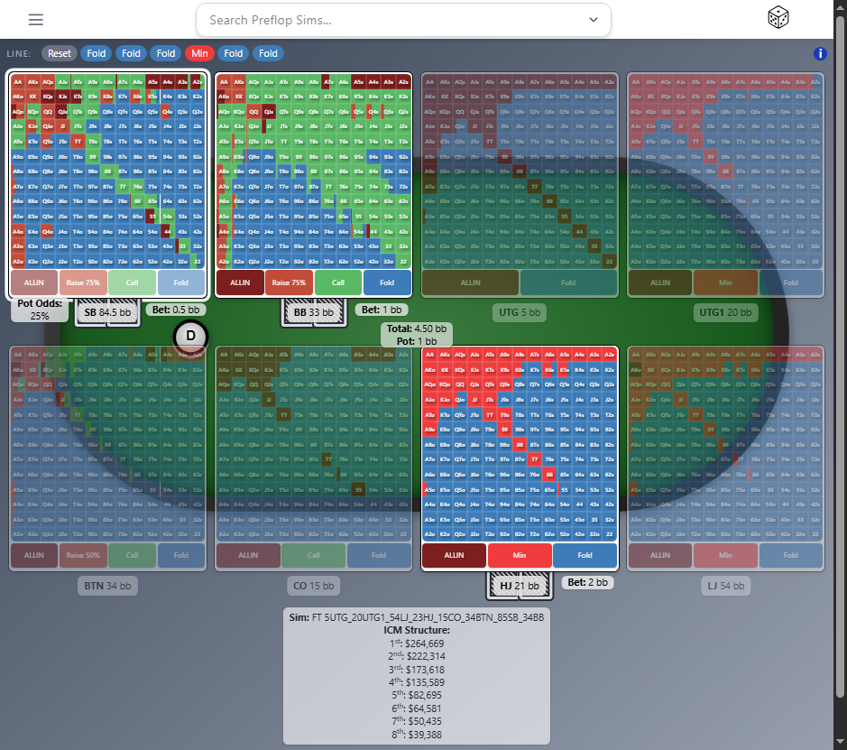
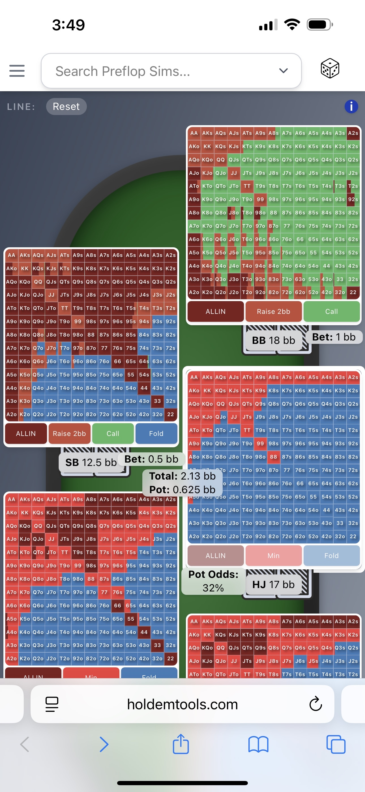

# HoldemTools **Front‑End** (App)

> **Live (preview):** [https://holdemtools.com](https://holdemtools.com) 


A modern, mobile‑first **React + TypeScript** interface that visualises solver‑derived pre‑flop strategies in real time. The app consumes data from the companion [HoldemTools API](https://github.com/<your‑user>/HoldemToolsAPI) and transforms raw JSON into an interactive, colour‑coded grid familiar to professional poker players—while abstracting away the heavy math for casual users.

---

## Why it’s interesting to engineers ✨

| 👍                                  | Engineering Highlights                                                                                                                             |
| ----------------------------------- | -------------------------------------------------------------------------------------------------------------------------------------------------- |
| **Component‑driven architecture**   | Fully typed React 18 components, collocated hooks (`useFiles`, `useFolders`, `useKeyboardShortcuts`) and context providers (for global app state). |
| **Real‑time data fetching**         | Parallel `axios` calls with cancellation tokens; progressive skeleton UI; auto‑retry on slow storage latency.                                      |
| **State machine for betting logic** | Functional reducer tracks stack sizes, pot odds, IC model payouts and bet trees; ensures UI ⟷ calculation parity.                                  |
| **Guided product tour**             | Contextual Intro.js steps (lazy‑booted, localStorage‑aware) to shorten onboarding.                                                                 |
| **Motion UX**                       | Framer‑Motion layoutId morphs for instant grid ⇆ zoom transitions with zero re‑render jank.                                                        |
| **Fully responsive**                | Plate grid auto‑reflows (spiral vs linear) on <440 px viewports; maintains square aspect ratio on iOS Safari split‑screen.                         |
| **CI/CD**                           | GitHub Actions → Vercel (preview PRs) → Production; Cypress smoke test gates every deploy.                                                         |
| **Secure by design**                | No storage keys, no business IP leak; front‑end talks only to public API endpoints behind Cloudflare.                                              |

---

## Screenshots

<p align="center">
  
  
</p>

*(Screenshots omit proprietary colour‑weights beyond the first node.)*

---

## Tech Stack

* **React 18 + TypeScript + Vite** – lightning‑fast dev server & static export
* **Tailwind CSS 3** – utility‑first design; dark‑mode & high‑contrast ready
* **Firebase Authentication** – email+password + Google OAuth; guarded routes
* **Axios** – typed API layer with interceptors for auth token refresh
* **Framer Motion** – shared layout animations (matrix zoom, plate focus)
* **Intro.js‑React** – product tour, persisted via `localStorage`
* **Jest + React Testing Library** – unit tests (\~90 % statements)
* **Cypress 13** – end‑to‑end smoke on every PR & production deploy

> **Note:** Actual solver ranges & EV data live in a private Azure Data Lake— nothing in this repo reveals them.

---

## Local Setup (5 steps)

```bash
# 1. Clone the repo
$ git clone https://github.com/<your‑user>/HoldemToolsFE.git && cd HoldemToolsFE

# 2. Install deps (pnpm recommended)
$ pnpm install

# 3. Env vars (never committed)
$ cp .env.example .env.local
$ echo "VITE_API_URL=https://<your‑api>.azurewebsites.net"   >> .env.local
$ echo "VITE_FIREBASE_API_KEY=<your‑firebase‑key>"          >> .env.local
#   … plus the other Firebase X vars

# 4. Run dev server
$ pnpm dev   # http://localhost:5173

# 5. (optional) Run tests
$ pnpm test:unit  &&  pnpm test:e2e
```

---

## Deployment

| Stage       | Platform             | Branch         | Notes                                                   |
| ----------- | -------------------- | -------------- | ------------------------------------------------------- |
| Preview PRs | Vercel / Deploy Hook | *pull‑request* | Auto‑generated URL e.g. `pr‑42--holdemtools.vercel.app` |
| Production  | Vercel (pro plan)    | `main`         | Protected push (CI green only)                          |

*GitHub Actions workflow `deploy.yml` lints, builds and uploads artefacts to Vercel. Secrets (`VERCEL_TOKEN`, `VERCEL_ORG_ID`, etc.) are stored in the repo’s encrypted vault.*

---

## Key Folders

```
src/
 ├─ components/      # Presentation + smart containers
 │    ├─ Solver.tsx
 │    ├─ PlateGrid.tsx
 │    ├─ Plate.tsx
 │    └─ …
 ├─ hooks/           # Reusable logic (API calls, keyboard shortcuts)
 ├─ utils/           # Pure helpers (grid math, sorting, constants)
 ├─ assets/          # SVGs & images (dealer button, cards)
 └─ firebase.ts      # Lazy‑initialised singleton
```

---

## Roadmap ↗️

* **Dashboard**: aggregate post‑flop nodes, heat‑maps, EV deltas
* **Monetisation**: Stripe checkout → tiered ranges, private cloud save
* **PWA offline** mode (indexedDB cache for frequent folders)
* **Accessibility**: full keyboard nav & screen‑reader labels
* **i18n**: Spanish & Portuguese support (largest potential audience)

---

## License & Contact

Closed‑source © 2025 Joshua Garber – Demo code and screenshots may be reused under the MIT License **excluding** solver outputs and proprietary range data.

> Interested in the full stack? Let’s chat: \<contact email> or LinkedIn.
